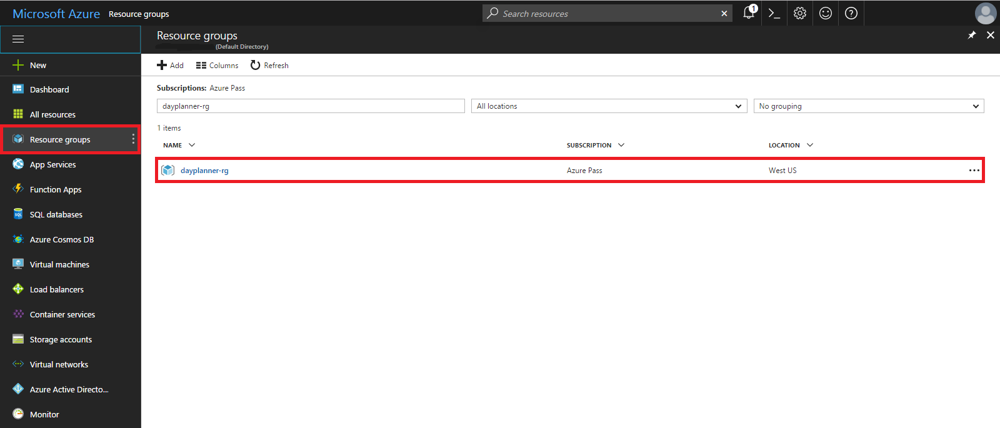
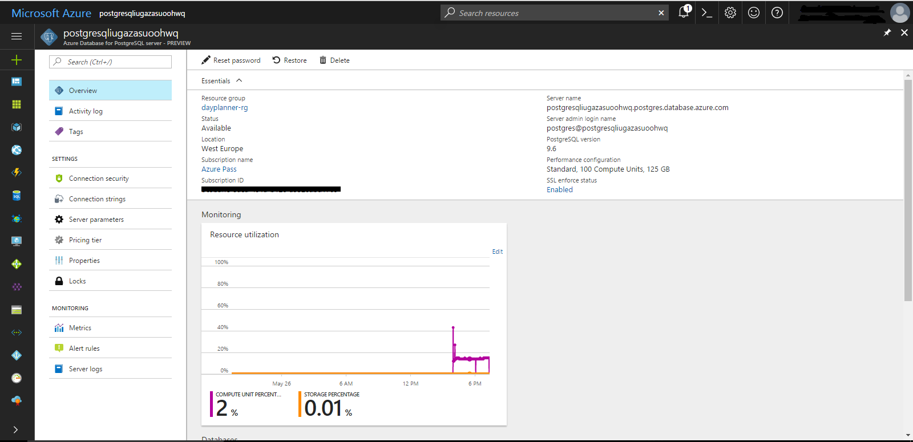
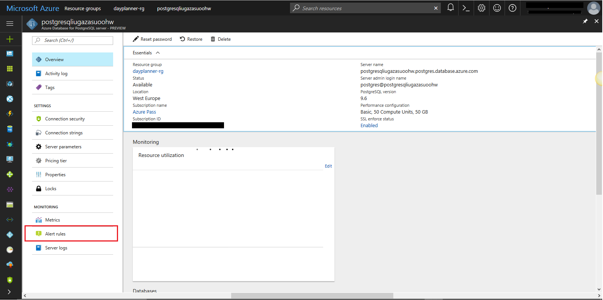
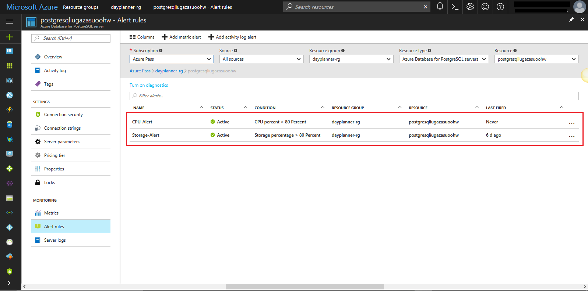
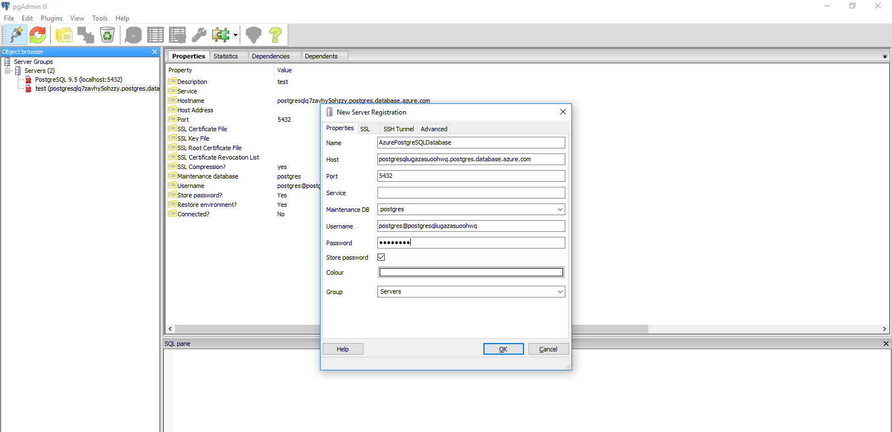
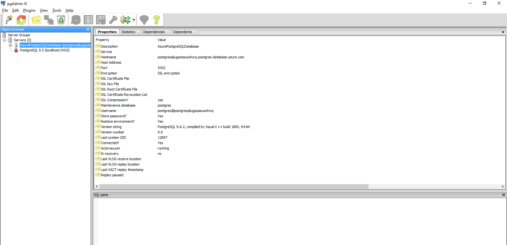
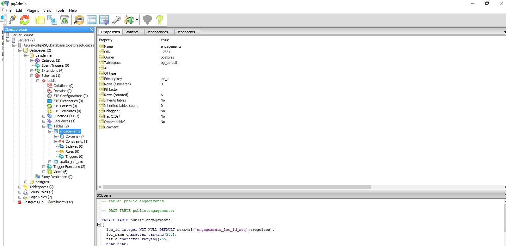

# Test PostgreSQL Connection

1. Go to <a href="https://portal.azure.com">Azure Portal</a>.	

1. Search for the resource group that you created using ARM Template.

    

1.	Click on the AzureDB for PostgreSQL managed service. 

    

1.	Click on the `Alert Rules` present on left side pannel. 

    

1.	There are two `Alert Rules` created while deploying with ARM Template.
      - __CPU-Alert:-__ This is a CPU usage based alert with a threshold of 80% over an evaluation window of 5 minutes. If the condition is violated the alert will transition to an “Active” state and when the alert condition is resolved the alert rules gets back to `Non Activated or Warning` states.  Each data point for CPU percentage is an average value over the last five minute period. In the backend the alerting engine evaluates each data point and triggers a state change event when a condition is violated or resolved.
       
      - __Storage-Alert:-__  This is a Storage based alert over an evaluation window of 5 minutes and if the Storage goes above 80%, the alert triggers.

    

1. Download <a href="https://www.pgadmin.org/download/">pgAdmin-3</a> for connecting the Server database on your local machine for testing the database connection.

1. Open the pgAdmin-3 to connect ServerDatabase on local environment. 

    - Name:- AzurePostgreSQLDatabase 
    - HostName:- postgresql3jx7gzpurh7yi.postgres.database.azure.com 
    - Username:- postgres@postgresql3jx7gzpurh7yi 
    - Password:- pg@12345  

    

1. After successful connection, the `AzurePostgreSQLDatabase` server will be visible on pgAdmin-3.

    

1.	The Server will contain `dayplanner` database at first which gets created during deployment. The first time that you run the Day Planner app then `engagements` table with sample data with current date will be created. 

    

1.	The schema of `engagements` table is as follows.
    
    Column Name | Data Type | Description
    ------------ | ---------|---------
    loc_id | serial | Unique id of engagement with auto-increament feature
    loc_name | character varying(255) | Location address of engagement where it is schedule
    title | character varying(255) | Subject of engagement
    date | date | Date of engagement
    start_time | time without time zone | Start time of engagement
    end_time | time without time zone | End time of engagement
    location | geography(Point) | latitude and longitude of engagement with PostGIS features

 
